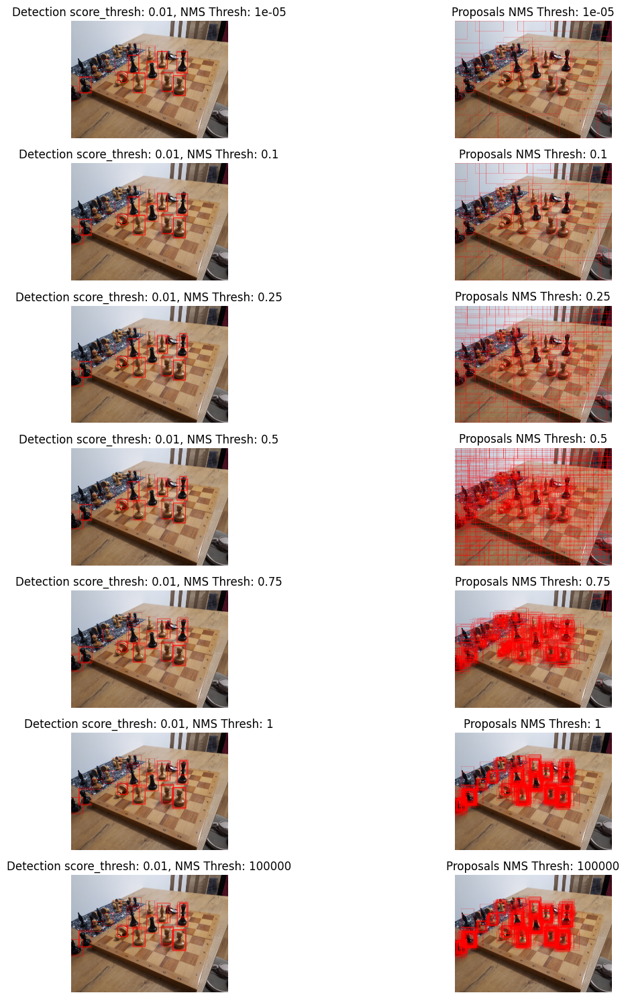
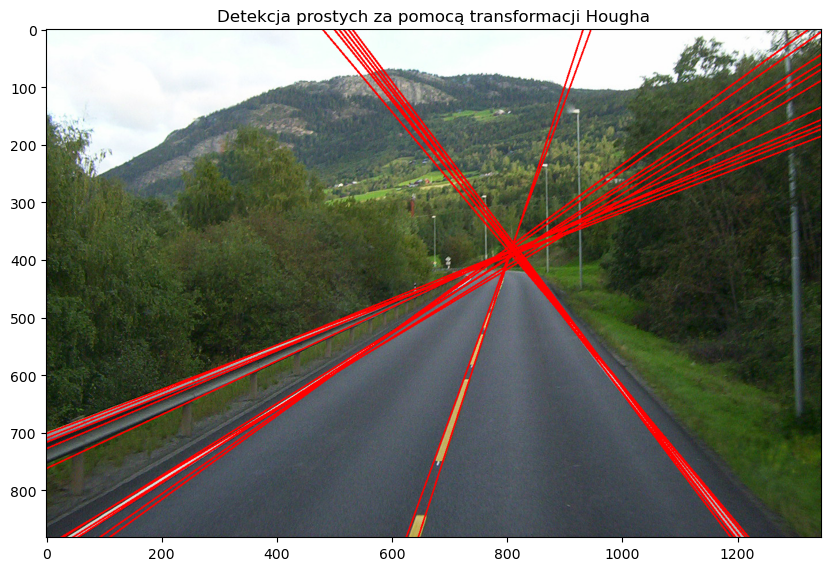
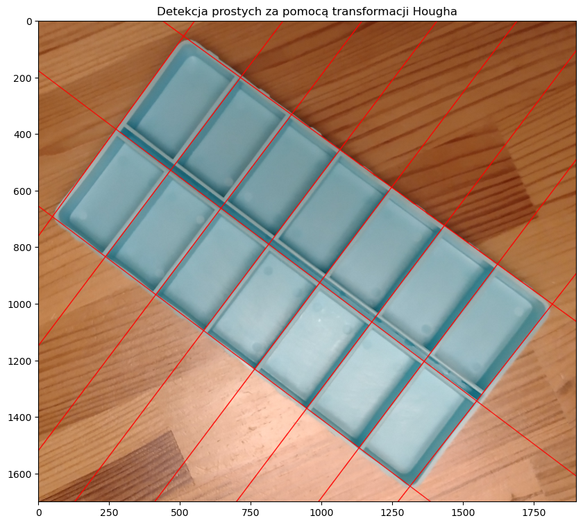
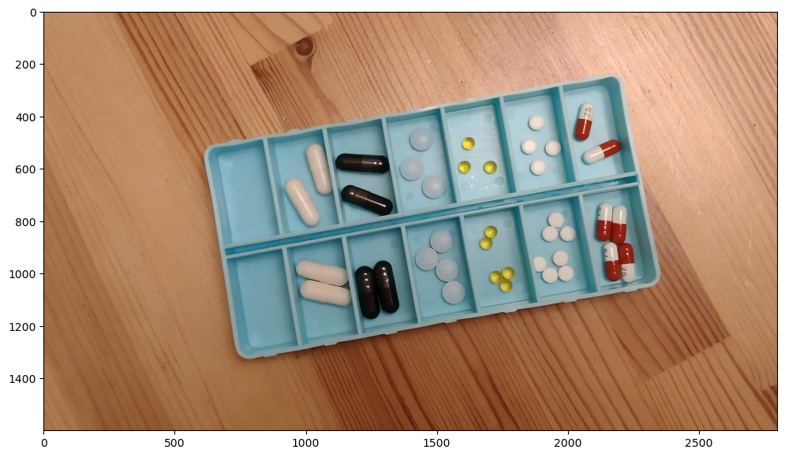
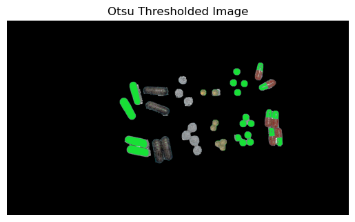
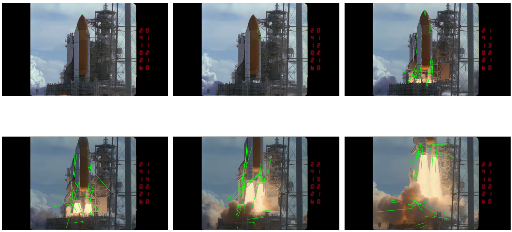
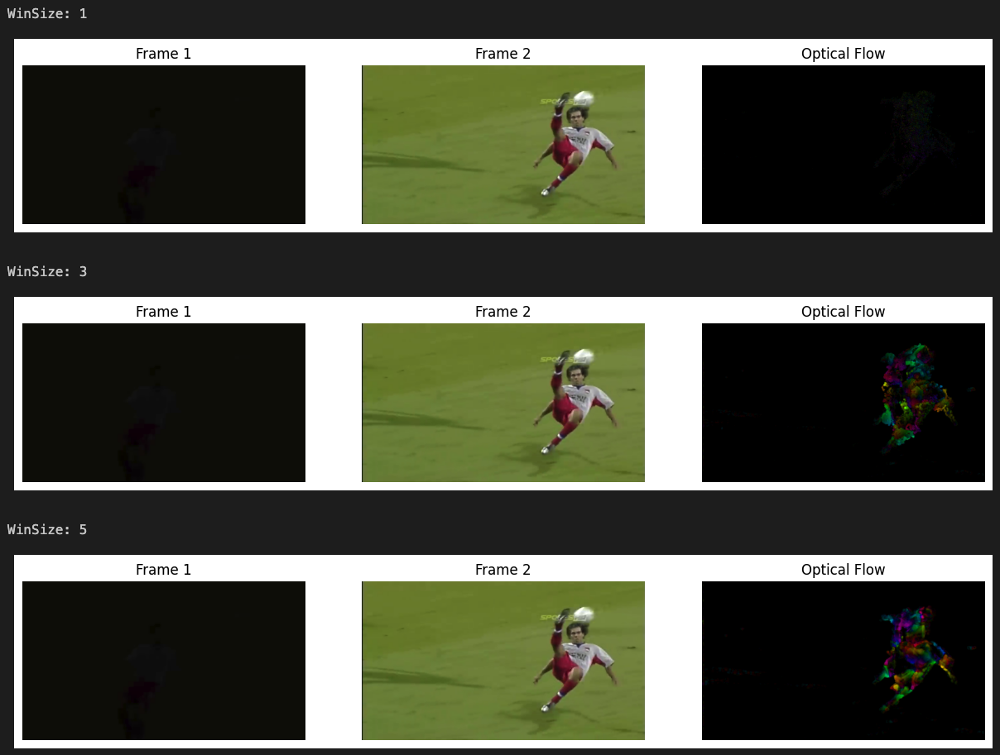

OpenCV simple tasks without deep-learning to gain intuition about:
* OTSU Thresholding
* HSV Color Space
* SLIC Superpixels
* Hough Transform
* Canny Edge Detector
* Morphological Operations
* etc

 

